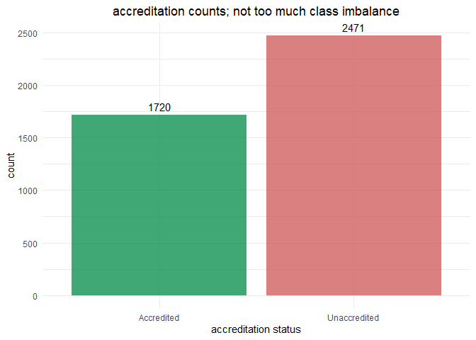
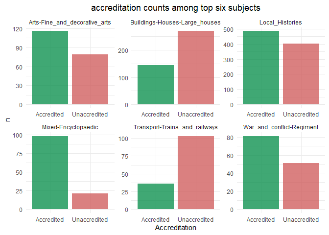
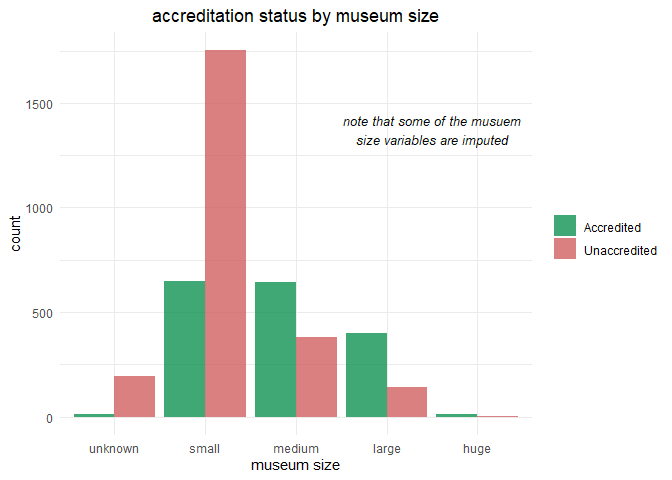
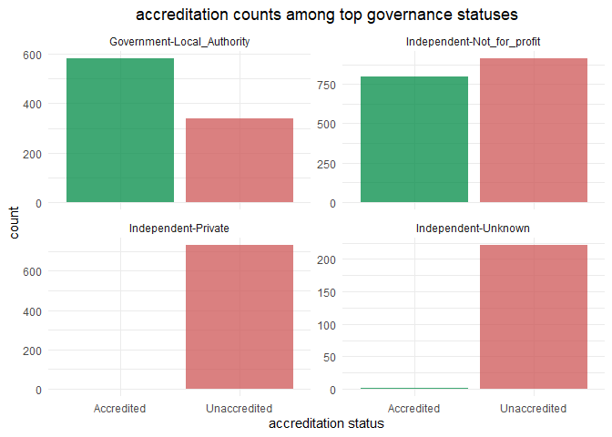
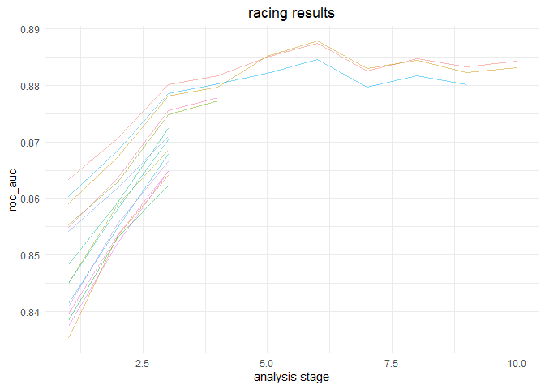
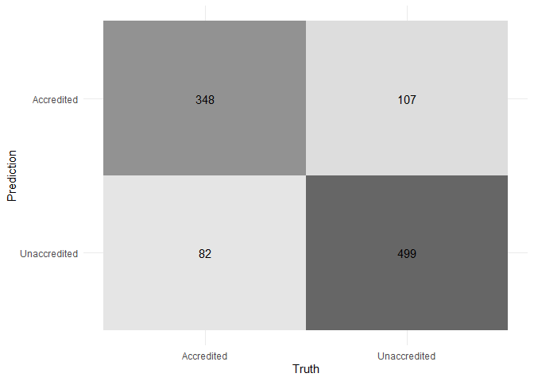
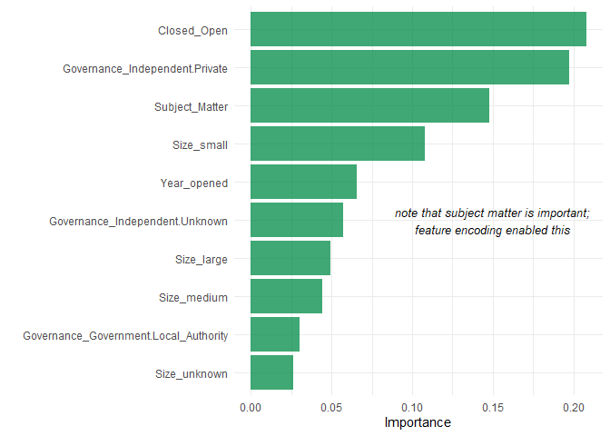
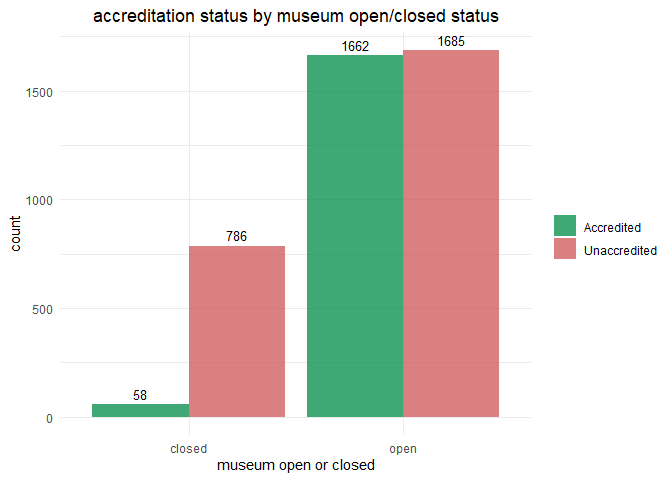

how to handle high-cardinality predictors for data on museums in the UK
================
chad allison
2023-01-25

### setup

``` r
tictoc::tic()
library(tidyverse) # essential functions
library(tidymodels) # modeling
library(embed) # feature encoding
library(skimr) # data skimming
library(finetune) # model tuning
library(vip) # variable importance
theme_set(theme_minimal())
update_geom_defaults("rect", list(fill = "springgreen4", alpha = 0.75))
```

### data import

``` r
link = "https://raw.githubusercontent.com/rfordatascience/tidytuesday/master/data/2022/2022-11-22/museums.csv"
museums = read_csv(link, col_types = cols())
glimpse(museums)
```

    ## Rows: 4,191
    ## Columns: 35
    ## $ museum_id                              <chr> "mm.New.1", "mm.aim.1230", "mm.~
    ## $ Name_of_museum                         <chr> "Titanic Belfast", "The Woodlan~
    ## $ Address_line_1                         <chr> "1 Olympic Way", NA, "Warwick C~
    ## $ Address_line_2                         <chr> NA, "Brokerswood", "Horticultur~
    ## $ `Village,_Town_or_City`                <chr> "Belfast", "nr Westbury", "More~
    ## $ Postcode                               <chr> "BT3 9EP", "BA13 4EH", "CV35 9B~
    ## $ Latitude                               <dbl> 54.60808, 51.27090, 52.19715, 4~
    ## $ Longitude                              <dbl> -5.909915, -2.231863, -1.555528~
    ## $ Admin_area                             <chr> "/Northern Ireland/Belfast (NI ~
    ## $ Accreditation                          <chr> "Unaccredited", "Unaccredited",~
    ## $ Governance                             <chr> "Independent-Not_for_profit", "~
    ## $ Size                                   <chr> "large", "small", "medium", "sm~
    ## $ Size_provenance                        <chr> NA, "aim_size_designation", "mm~
    ## $ Subject_Matter                         <chr> "Sea_and_seafaring-Boats_and_sh~
    ## $ Year_opened                            <chr> "2012:2012", "1971:1971", "1984~
    ## $ Year_closed                            <chr> "9999:9999", "2007:2017", "9999~
    ## $ DOMUS_Subject_Matter                   <chr> NA, NA, NA, NA, NA, NA, NA, "sc~
    ## $ DOMUS_identifier                       <dbl> NA, NA, 1218, NA, NA, NA, 1528,~
    ## $ Primary_provenance_of_data             <chr> "New", "aim", "domus", "aim", "~
    ## $ Identifier_used_in_primary_data_source <chr> NA, NA, "WM000019", NA, NA, NA,~
    ## $ Area_Deprivation_index                 <dbl> 2, 9, 8, NA, 8, 2, 6, 6, 5, 6, ~
    ## $ Area_Deprivation_index_crime           <dbl> 3, 8, 9, NA, 10, 1, 10, 3, 1, 1~
    ## $ Area_Deprivation_index_education       <dbl> 1, 9, 8, NA, 7, 6, 8, 7, 7, 6, ~
    ## $ Area_Deprivation_index_employment      <dbl> 2, 8, 10, NA, 7, 3, 7, 6, 6, 7,~
    ## $ Area_Deprivation_index_health          <dbl> 1, 8, 8, NA, 8, 2, 7, 8, 5, 7, ~
    ## $ Area_Deprivation_index_housing         <dbl> 4, 6, 5, NA, 7, 1, 8, 9, 1, 7, ~
    ## $ Area_Deprivation_index_income          <dbl> 5, 8, 8, NA, 8, 3, 5, 5, 7, 5, ~
    ## $ Area_Deprivation_index_services        <dbl> 5, 4, 1, NA, 4, 4, 2, 3, 9, 1, ~
    ## $ Area_Geodemographic_group              <chr> "Larger Towns and Cities", "Cou~
    ## $ Area_Geodemographic_group_code         <chr> "2ar", "7ar", "3ar", NA, "7ar",~
    ## $ Area_Geodemographic_subgroup           <chr> "Larger Towns and Cities", "Cou~
    ## $ Area_Geodemographic_subgroup_code      <chr> "2a1r", "7a1r", "3a1r", NA, "7a~
    ## $ Area_Geodemographic_supergroup         <chr> "Business Education and Heritag~
    ## $ Area_Geodemographic_supergroup_code    <chr> "2r", "7r", "3r", NA, "7r", "5r~
    ## $ Notes                                  <chr> NA, "Previously known as Philli~

### visualizing `Accrediation` counts (our outcome variable)

``` r
museums |>
  count(Accreditation) |>
  ggplot(aes(Accreditation, n)) +
  geom_col(aes(fill = Accreditation), alpha = 0.75) +
  geom_text(aes(label = n), vjust = -0.5) +
  scale_fill_manual(values = c("springgreen4", "indianred3")) +
  labs(x = "accreditation status", y = "count",
       title = "accreditation counts; not too much class imbalance") +
  theme(plot.title = element_text(hjust = 0.5),
        legend.position = "none")
```

<!-- -->

### closer look at top subject matters

``` r
top_subjects = museums |>
  count(Subject_Matter, sort = T) |>
  slice_max(n, n = 6) |>
  pull(Subject_Matter)

museums |>
  filter(Subject_Matter %in% top_subjects) |>
  count(Subject_Matter, Accreditation) |>
  ggplot(aes(Accreditation, n)) +
  geom_col(aes(fill = Accreditation), show.legend = F, alpha = 0.75) +
  scale_fill_manual(values = c("springgreen4", "indianred3")) +
  facet_wrap(vars(Subject_Matter), scales = "free") +
  labs(title = "accreditation counts among top six subjects") +
  theme(plot.title = element_text(hjust = 0.5))
```

<!-- -->

### accreditation counts for different museum sizes

``` r
museums |>
  count(Accreditation, Size) |>
  mutate(Size = factor(Size, levels = c("unknown", "small", "medium", "large", "huge"))) |>
  ggplot(aes(Size, n)) +
  geom_col(aes(fill = Accreditation), position = "dodge", alpha = 0.75) +
  scale_fill_manual(values = c("springgreen4", "indianred3")) +
  annotate("text", x = 4.5, y = 1375, size = 3.5, fontface = "italic",
           label = "note that some of the musuem\nsize variables are imputed") +
  labs(x = "museum size", y = "count", fill = NULL,
       title = "accreditation status by museum size") +
  theme(plot.title = element_text(hjust = 0.5))
```

<!-- -->

### governance status and accreditation counts

``` r
top_gov = museums |>
  count(Governance, sort = T) |>
  slice_max(n, n = 4) |>
  pull(Governance)

museums |>
  filter(Governance %in% top_gov) |>
  count(Governance, Accreditation) |>
  ggplot(aes(Accreditation, n)) +
  geom_col(aes(fill = Accreditation), show.legend = F, alpha = 0.75) +
  scale_fill_manual(values = c("springgreen4", "indianred3")) +
  facet_wrap(vars(Governance), scales = "free_y") +
  labs(x = "accreditation status", y = "count",
       title = "accreditation counts among top governance statuses") +
  theme(plot.title = element_text(hjust = 0.5))
```

<!-- -->

### getting data for modeling

``` r
museums_parsed = museums |>
  select(museum_id, Accreditation, Governance, Size, Subject_Matter,
         Year_opened, Year_closed, Area_Deprivation_index) |>
  mutate(Year_opened = parse_number(Year_opened),
         Closed = ifelse(Year_closed == "9999:9999", "Open", "Closed")) |>
  select(-Year_closed) |>
  na.omit() |>
  mutate_if(is.character, as.factor) |>
  mutate(museum_id = as.character(museum_id))

glimpse(museums_parsed)
```

    ## Rows: 4,142
    ## Columns: 8
    ## $ museum_id              <chr> "mm.New.1", "mm.aim.1230", "mm.domus.WM019", "m~
    ## $ Accreditation          <fct> Unaccredited, Unaccredited, Unaccredited, Accre~
    ## $ Governance             <fct> Independent-Not_for_profit, Independent-Unknown~
    ## $ Size                   <fct> large, small, medium, medium, small, small, sma~
    ## $ Subject_Matter         <fct> Sea_and_seafaring-Boats_and_ships, Natural_worl~
    ## $ Year_opened            <dbl> 2012, 1971, 1984, 2013, 1996, 1980, 1993, 1854,~
    ## $ Area_Deprivation_index <dbl> 2, 9, 8, 8, 2, 6, 6, 5, 6, 3, 7, 5, 8, 6, 9, 1,~
    ## $ Closed                 <fct> Open, Closed, Open, Open, Closed, Closed, Open,~

### data splitting and cross validation

``` r
set.seed(123)
museum_split = initial_split(museums_parsed, prop = 0.75, strata = Accreditation)
museum_train = training(museum_split)
museum_test = testing(museum_split)

set.seed(234)
museum_folds = vfold_cv(museum_train, strata = Accreditation)
museum_folds
```

    ## #  10-fold cross-validation using stratification 
    ## # A tibble: 10 x 2
    ##    splits             id    
    ##    <list>             <chr> 
    ##  1 <split [2795/311]> Fold01
    ##  2 <split [2795/311]> Fold02
    ##  3 <split [2795/311]> Fold03
    ##  4 <split [2795/311]> Fold04
    ##  5 <split [2795/311]> Fold05
    ##  6 <split [2795/311]> Fold06
    ##  7 <split [2795/311]> Fold07
    ##  8 <split [2796/310]> Fold08
    ##  9 <split [2796/310]> Fold09
    ## 10 <split [2797/309]> Fold10

### creating recipe while handling high-cardinality

``` r
museum_rec = recipe(Accreditation ~ ., data = museum_train) |>
  update_role(museum_id, new_role = "id") |>
  step_lencode_glm(Subject_Matter, outcome = vars(Accreditation)) |> # embed
  step_dummy(all_nominal_predictors())

prep(museum_rec) |>
  bake(new_data = NULL) |>
  skim()
```

|                                                  |                            |
|:-------------------------------------------------|:---------------------------|
| Name                                             | bake(prep(museum_rec), ne… |
| Number of rows                                   | 3106                       |
| Number of columns                                | 22                         |
| \_\_\_\_\_\_\_\_\_\_\_\_\_\_\_\_\_\_\_\_\_\_\_   |                            |
| Column type frequency:                           |                            |
| factor                                           | 2                          |
| numeric                                          | 20                         |
| \_\_\_\_\_\_\_\_\_\_\_\_\_\_\_\_\_\_\_\_\_\_\_\_ |                            |
| Group variables                                  | None                       |

Data summary

**Variable type: factor**

| skim_variable | n_missing | complete_rate | ordered | n_unique | top_counts                     |
|:--------------|----------:|--------------:|:--------|---------:|:-------------------------------|
| museum_id     |         0 |             1 | FALSE   |     3106 | dom: 1, mm.: 1, mm.: 1, mm.: 1 |
| Accreditation |         0 |             1 | FALSE   |        2 | Una: 1817, Acc: 1289           |

**Variable type: numeric**

| skim_variable                                        | n_missing | complete_rate |    mean |    sd |      p0 |     p25 |     p50 |     p75 |    p100 | hist  |
|:-----------------------------------------------------|----------:|--------------:|--------:|------:|--------:|--------:|--------:|--------:|--------:|:------|
| Subject_Matter                                       |         0 |             1 |   -0.69 |  2.53 |  -16.57 |   -0.89 |   -0.25 |    0.17 |   16.57 | ▁▁▇▁▁ |
| Year_opened                                          |         0 |             1 | 1969.11 | 38.50 | 1621.00 | 1959.00 | 1978.00 | 1993.00 | 2021.00 | ▁▁▁▁▇ |
| Area_Deprivation_index                               |         0 |             1 |    5.43 |  2.47 |    1.00 |    4.00 |    5.00 |    7.00 |   10.00 | ▅▆▇▆▃ |
| Governance_Government.Local_Authority                |         0 |             1 |    0.22 |  0.41 |    0.00 |    0.00 |    0.00 |    0.00 |    1.00 | ▇▁▁▁▂ |
| Governance_Government.National                       |         0 |             1 |    0.02 |  0.14 |    0.00 |    0.00 |    0.00 |    0.00 |    1.00 | ▇▁▁▁▁ |
| Governance_Government.Other                          |         0 |             1 |    0.00 |  0.04 |    0.00 |    0.00 |    0.00 |    0.00 |    1.00 | ▇▁▁▁▁ |
| Governance_Independent.English_Heritage              |         0 |             1 |    0.01 |  0.11 |    0.00 |    0.00 |    0.00 |    0.00 |    1.00 | ▇▁▁▁▁ |
| Governance_Independent.Historic_Environment_Scotland |         0 |             1 |    0.00 |  0.07 |    0.00 |    0.00 |    0.00 |    0.00 |    1.00 | ▇▁▁▁▁ |
| Governance_Independent.National_Trust                |         0 |             1 |    0.04 |  0.21 |    0.00 |    0.00 |    0.00 |    0.00 |    1.00 | ▇▁▁▁▁ |
| Governance_Independent.National_Trust_for_Scotland   |         0 |             1 |    0.01 |  0.08 |    0.00 |    0.00 |    0.00 |    0.00 |    1.00 | ▇▁▁▁▁ |
| Governance_Independent.Not_for_profit                |         0 |             1 |    0.42 |  0.49 |    0.00 |    0.00 |    0.00 |    1.00 |    1.00 | ▇▁▁▁▆ |
| Governance_Independent.Private                       |         0 |             1 |    0.17 |  0.38 |    0.00 |    0.00 |    0.00 |    0.00 |    1.00 | ▇▁▁▁▂ |
| Governance_Independent.Unknown                       |         0 |             1 |    0.05 |  0.22 |    0.00 |    0.00 |    0.00 |    0.00 |    1.00 | ▇▁▁▁▁ |
| Governance_University                                |         0 |             1 |    0.03 |  0.16 |    0.00 |    0.00 |    0.00 |    0.00 |    1.00 | ▇▁▁▁▁ |
| Governance_Unknown                                   |         0 |             1 |    0.03 |  0.16 |    0.00 |    0.00 |    0.00 |    0.00 |    1.00 | ▇▁▁▁▁ |
| Size_large                                           |         0 |             1 |    0.13 |  0.34 |    0.00 |    0.00 |    0.00 |    0.00 |    1.00 | ▇▁▁▁▁ |
| Size_medium                                          |         0 |             1 |    0.24 |  0.43 |    0.00 |    0.00 |    0.00 |    0.00 |    1.00 | ▇▁▁▁▂ |
| Size_small                                           |         0 |             1 |    0.58 |  0.49 |    0.00 |    0.00 |    1.00 |    1.00 |    1.00 | ▆▁▁▁▇ |
| Size_unknown                                         |         0 |             1 |    0.04 |  0.20 |    0.00 |    0.00 |    0.00 |    0.00 |    1.00 | ▇▁▁▁▁ |
| Closed_Open                                          |         0 |             1 |    0.80 |  0.40 |    0.00 |    1.00 |    1.00 |    1.00 |    1.00 | ▂▁▁▁▇ |

### looking at the effects of the subject matter encodings

``` r
prep(museum_rec) |>
  tidy(number = 1) |>
  filter(level == "..new") |>
  mutate(value = round(value, 3))
```

    ## # A tibble: 1 x 4
    ##   level  value terms          id               
    ##   <chr>  <dbl> <chr>          <chr>            
    ## 1 ..new -0.909 Subject_Matter lencode_glm_kFEsv

### creating model specification

``` r
xgb_spec = boost_tree(trees = tune(), min_n = tune(), mtry = tune(), learn_rate = 0.01) |>
  set_engine("xgboost") |>
  set_mode("classification")

xgb_spec
```

    ## Boosted Tree Model Specification (classification)
    ## 
    ## Main Arguments:
    ##   mtry = tune()
    ##   trees = tune()
    ##   min_n = tune()
    ##   learn_rate = 0.01
    ## 
    ## Computational engine: xgboost

### creating workflow

``` r
xgb_wf = workflow(museum_rec, xgb_spec)
xgb_wf
```

    ## == Workflow ====================================================================
    ## Preprocessor: Recipe
    ## Model: boost_tree()
    ## 
    ## -- Preprocessor ----------------------------------------------------------------
    ## 2 Recipe Steps
    ## 
    ## * step_lencode_glm()
    ## * step_dummy()
    ## 
    ## -- Model -----------------------------------------------------------------------
    ## Boosted Tree Model Specification (classification)
    ## 
    ## Main Arguments:
    ##   mtry = tune()
    ##   trees = tune()
    ##   min_n = tune()
    ##   learn_rate = 0.01
    ## 
    ## Computational engine: xgboost

### tuning

``` r
doParallel::registerDoParallel()
set.seed(345)
xgb_rs = tune_race_anova(xgb_wf,
                resamples = museum_folds,
                grid = 15,
                control = control_race(verbose_elim = T))
```

    ## i Creating pre-processing data to finalize unknown parameter: mtry

    ## i Racing will maximize the roc_auc metric.i Resamples are analyzed in a random
    ## order.i Fold10: 10 eliminated; 5 candidates remain.i Fold07: 2 eliminated;
    ## 3 candidates remain.i Fold03: 0 eliminated; 3 candidates remain.i Fold05: 0
    ## eliminated; 3 candidates remain.i Fold09: 0 eliminated; 3 candidates remain.i
    ## Fold04: 0 eliminated; 3 candidates remain.i Fold06: 1 eliminated; 2 candidates
    ## remain.

``` r
xgb_rs
```

    ## # Tuning results
    ## # 10-fold cross-validation using stratification 
    ## # A tibble: 10 x 5
    ##    splits             id     .order .metrics          .notes          
    ##    <list>             <chr>   <int> <list>            <list>          
    ##  1 <split [2795/311]> Fold01      2 <tibble [30 x 7]> <tibble [0 x 1]>
    ##  2 <split [2795/311]> Fold02      3 <tibble [30 x 7]> <tibble [0 x 1]>
    ##  3 <split [2797/309]> Fold10      1 <tibble [30 x 7]> <tibble [0 x 1]>
    ##  4 <split [2795/311]> Fold07      4 <tibble [10 x 7]> <tibble [0 x 1]>
    ##  5 <split [2795/311]> Fold03      5 <tibble [6 x 7]>  <tibble [0 x 1]>
    ##  6 <split [2795/311]> Fold05      6 <tibble [6 x 7]>  <tibble [0 x 1]>
    ##  7 <split [2796/310]> Fold09      7 <tibble [6 x 7]>  <tibble [0 x 1]>
    ##  8 <split [2795/311]> Fold04      8 <tibble [6 x 7]>  <tibble [0 x 1]>
    ##  9 <split [2795/311]> Fold06      9 <tibble [6 x 7]>  <tibble [0 x 1]>
    ## 10 <split [2796/310]> Fold08     10 <tibble [4 x 7]>  <tibble [0 x 1]>

### plotting tuning results

``` r
plot_race(xgb_rs) +
  labs(x = "analysis stage", title = "racing results") +
  theme(plot.title = element_text(hjust = 0.5))
```

<!-- -->

### modeling metrics

``` r
collect_metrics(xgb_rs)
```

    ## # A tibble: 30 x 9
    ##     mtry trees min_n .metric  .estimator  mean     n std_err .config            
    ##    <int> <int> <int> <chr>    <chr>      <dbl> <int>   <dbl> <chr>              
    ##  1     2   599     8 accuracy binary     0.796    10 0.00735 Preprocessor1_Mode~
    ##  2     2   599     8 roc_auc  binary     0.884    10 0.00540 Preprocessor1_Mode~
    ##  3     3  1805    31 accuracy binary     0.785     3 0.0177  Preprocessor1_Mode~
    ##  4     3  1805    31 roc_auc  binary     0.864     3 0.0149  Preprocessor1_Mode~
    ##  5     4   136     3 accuracy binary     0.796    10 0.00781 Preprocessor1_Mode~
    ##  6     4   136     3 roc_auc  binary     0.883    10 0.00596 Preprocessor1_Mode~
    ##  7     6   122    21 accuracy binary     0.786     3 0.0169  Preprocessor1_Mode~
    ##  8     6   122    21 roc_auc  binary     0.869     3 0.0125  Preprocessor1_Mode~
    ##  9     7  1536    11 accuracy binary     0.796     4 0.0135  Preprocessor1_Mode~
    ## 10     7  1536    11 roc_auc  binary     0.877     4 0.00933 Preprocessor1_Mode~
    ## # ... with 20 more rows

### fitting model on all training data, evaluating on testing data

``` r
xgb_last = xgb_wf |>
  finalize_workflow(select_best(xgb_rs, "accuracy")) |>
  last_fit(museum_split)

xgb_last |>
  collect_metrics()
```

    ## # A tibble: 2 x 4
    ##   .metric  .estimator .estimate .config             
    ##   <chr>    <chr>          <dbl> <chr>               
    ## 1 accuracy binary         0.818 Preprocessor1_Model1
    ## 2 roc_auc  binary         0.891 Preprocessor1_Model1

### confusion matrix

``` r
collect_predictions(xgb_last) |>
  conf_mat(Accreditation, .pred_class) |>
  autoplot(type = "heatmap")
```

<!-- -->

### variable importance

``` r
xgb_last |>
  extract_fit_engine() |>
  vip() +
  annotate("text", x = 5, y = 0.15, size = 3.5, fontface = "italic",
           label = "note that subject matter is important;\nfeature encoding enabled this")
```

<!-- -->

### visualizing original data given variable importance

``` r
museums |>
  mutate(closed = ifelse(Year_closed == "9999:9999", "open", "closed")) |>
  count(Accreditation, closed) |>
  ggplot(aes(closed, n)) +
  geom_col(aes(fill = Accreditation), position = "dodge") +
  geom_text(aes(label = n), vjust = -0.5, position = position_dodge2(width = 0.9), size = 3.5) +
  scale_fill_manual(values = c("springgreen4", "indianred3")) +
  labs(x = "museum open or closed", y = "count", fill = NULL,
       title = "accreditation status by museum open/closed status") +
  theme(plot.title = element_text(hjust = 0.5))
```

<!-- -->

### script runtime

``` r
tictoc::toc()
```

    ## 104.47 sec elapsed
